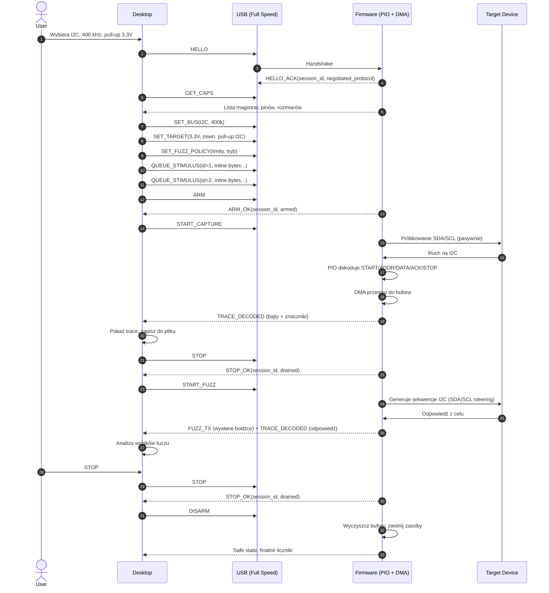

# Analizator I2C/UART z Opcjonalną Injekcją Bodźców (Raspberry Pi Pico)

## 1. Przegląd

**Cele:** Pasywna analiza protokołów I2C/UART oraz opcjonalna aktywna injekcja prostych bodźców i ramek.

**Fizyka:** RP2040 z 8 maszynami stanów PIO (2 bloki × 4 SM), USB 1.1 Full Speed device, DMA dla oddzielenia próbkowania od transferu.

**Zasada:** PIO i DMA obsługują real-time capture, USB przenosi rozkazy i zdekodowane dane, desktop zarządza sesjami i logiką bodźców.

**Zakres wersji:**
- v1: analyzer/sniffer.
- v2: aktywna injekcja bodźców.
- v3: adaptacyjny fuzzing, jeśli feedback i obserwacja DUT okażą się wystarczające.

---

## 2. Granica Odpowiedzialności

### Firmware (RP2040)

**Musi robić:**
- Próbkować / dekodować I2C i UART w PIO (deterministycznie, bez CPU).
- Akumulować dane w buforze pierścieniowym (DMA lub CPU).
- Wysyłać zdekodowane rekordy (bajty, znaczniki, zdarzenia) przez USB.
- Egzekwować bezpieczeństwo: domyślnie rozbrojony, wymaga jawnego ARM.
- Raportować przepełnienia i straty zamiast je ukrywać.

**Nie robi:**
- Kontrola sesji (to desktop).
- Logika fuzzu (to desktop).
- Zapisywanie do pliku (to desktop).
- Analiza protokołu wyższego poziomu (to desktop).

### Desktop (C++/Qt)

**Musi robić:**
- Odkrywanie i enumeracja urządzeń.
- Zarządzanie sesją (HELLO, ARM, STOP, DISARM).
- Wysyłanie polityki fuzzu i konfiguracji (profil płytki, bus, baud, etc.).
- Odbieranie zdekomponowanych danych.
- Logika fuzzu: wybór zestawu testowego, harmonogram, analiza wyniku.
- Prezentacja UI, zapis wyników.

**Nie robi:**
- Real-time próbkowanie (to PIO).
- Jakakolwiek aktywność na pinach przed jawnym ARM.

---

## 3. Ramka Wymiany Danych

Wszystkie wiadomości: nagłówek (16 B) + zmienny payload.

| Pole | Rozmiar | Opis | Przykład |
|---|---:|---|---|
| Magic | 2 B | Znacznik | `0xAA55` |
| Wersja | 1 B | Protokół | `0x01` |
| Typ | 1 B | Rodzaj msg | `0x10` (CAPS_REQ) |
| Flagi | 1 B | Opcje | `0x00` |
| Padding | 1 B | Wyrównanie payloadu | `0x00` |
| Session | 2 B | ID sesji | `0x0042` |
| Sequence | 4 B | Numer | `0x00000001` |
| Length | 2 B | Payload len | `0x0000` |
| Checksum | 2 B | CRC-16/CCITT-FALSE | `0x29B1` |
| Payload | N B | Dane | zależne |

**Zasady ramki:**
- Wszystkie pola wielobajtowe są little-endian.
- `Checksum` liczony jest po polach `Magic..Length` oraz po całym `Payload`.
- Wersja 1 używa CRC-16/CCITT-FALSE: poly `0x1021`, init `0xFFFF`, xorout `0x0000`, bez reflect.
- Zmiana formatu payloadu wymaga nowego typu komendy albo zmiany wersji protokołu.
- `Padding` ma stałą wartość `0x00`; jego celem jest wyrównanie payloadu do 4 bajtów, żeby firmware nie musiał wykonywać niewyrównanych odczytów 16/32-bitowych.

### Główne Typy Komend

| Kierunek | Typ | Opis |
|---|---|---|
| **PC → Pico** | `HELLO` | Handshake i negocjacja wersji |
| | `GET_CAPS` | Żądanie możliwości (piny, magistrale, rozmiary buforów) |
| | `GET_STATUS` | Bieżący stan sesji i liczniki |
| | `SET_BUS` | Wybór I2C lub UART + parametry |
| | `SET_TARGET` | Napięcie, kierunek pinów, zewnętrzne pull-up dla I2C |
| | `SET_FUZZ_POLICY` | Polityka bodźców, limity, priorytety |
| | `QUEUE_STIMULUS` | Opaque corpus/stimulus bytes do wykonania w trybie corpus-guided |
| | `ARM` | Walidacja i rezerwacja zasobów |
| | `START_CAPTURE` | Początek przechwytywania pasywnego |
| | `START_FUZZ` | Początek fuzzingu po `SET_FUZZ_POLICY` i `ARM` |
| | `STOP` | Stop aktywności i opróżnienie buforów |
| | `DISARM` | Powrót do bezpiecznego stanu |
| | `RESET_SESSION` | Zerowanie stanu sesji po błędzie |
| **Pico → PC** | `CAPS_RESPONSE` | Lista możliwości |
| | `HELLO_ACK` | Negocjacja wersji i utworzenie sesji |
| | `ARM_OK` | Potwierdzenie uzbrojenia |
| | `STOP_OK` | Potwierdzenie zatrzymania |
| | `STATUS` | Stan sesji, liczniki, przepełnienia |
| | `TRACE_DECODED` | Zdekodowane rekordy (bajty, zdarzenia, znaczniki czasu) |
| | `FUZZ_TX` | Wysłany bodziec (dla powiązania z wynikami) |
| | `COUNTERS` | Przepełnienia, straty, naruszenia czasowe |
| | `ERROR` | Błąd z kodem i komunikatem |

### Format payloadów

Payloady są serializowane w kolejności zapisanej poniżej. Firmware nie powinno rzutować surowego bufora na strukturę `packed`; ma czytać pola przez jawne dekodowanie albo przez kopiowanie do lokalnych, wyrównanych zmiennych. Tam, gdzie to możliwe, pola większe (`u32`, potem `u16`, potem `u8`) są ułożone wcześniej, żeby ograniczyć ryzyko niewyrównanych odczytów.

| Typ | Payload binarny |
|---|---|
| `HELLO` | `requested_protocol:u8`, `client_flags:u8`, `client_version:u16`, `reserved:u16` |
| `HELLO_ACK` | `negotiated_protocol:u8`, `fw_flags:u8`, `fw_version:u16`, `session_id:u16`, `reserved:u16` |
| `SET_BUS` | `speed_hz:u32`, `bus_type:u8`, `bus_flags:u8`, `pin_a:u8`, `pin_b:u8`, `uart_parity:u8`, `uart_stop_bits:u8`, `reserved:u8`, `reserved2:u8` |
| `SET_TARGET` | `vtarget_mv:u16`, `pin_dir_mask:u8`, `pullup_mode:u8`, `pullup_mask:u8`, `reserved:u8`, `reserved2:u16` |
| `SET_FUZZ_POLICY` | `time_budget_ms:u32`, `pending_bytes:u16`, `policy_flags:u8`, `selection_mode:u8`, `repeat_mode:u8`, `max_pending:u8`, `reserved:u8`, `reserved2:u8` |
| `QUEUE_STIMULUS` | `stimulus_id:u32`, `data_len:u16`, `stimulus_flags:u8`, `stimulus_kind:u8`, `data[]` |
| `ARM` | `session_id:u16`, `arm_flags:u8`, `reserved:u8` |
| `STATUS` | `rx_overruns:u32`, `tx_underruns:u32`, `armed_since_ms:u32`, `session_id:u16`, `last_error:u16`, `state:u8`, `flags:u8`, `queued_stimuli:u8`, `reserved:u8` |
| `CAPS_RESPONSE` | `buffer_bytes:u32`, `max_burst_bytes:u16`, `fw_version:u8`, `protocol_version:u8`, `bus_mask:u8`, `supported_modes:u8`, `pio_sm_count:u8`, `reserved:u8`, `pin_map_count:u8`, `reserved2:u8`, `reserved3:u8`, `reserved4:u8`, `pin_map[]` |
| `TRACE_DECODED` | `trace_seq:u32`, `timestamp_us:u32`, `data_len:u16`, `source_bus:u8`, `event_type:u8`, `data[]` |
| `FUZZ_TX` | `stimulus_id:u32`, `trace_seq:u32`, `mode:u8`, `flags:u8`, `data_len:u16`, `data[]` |
| `ARM_OK` | `session_id:u16`, `state:u8`, `reserved:u8` |
| `STOP_OK` | `drained_bytes:u32`, `session_id:u16`, `state:u8`, `reserved:u8` |
| `ERROR` | `context_code:u16`, `error_code:u16`, `message_len:u16`, `severity:u8`, `reserved:u8`, `message[]` |

`GET_CAPS` i `GET_STATUS` nie mają payloadu.

`GET_STATUS` zwraca odpowiedź `STATUS`.

`ARM_OK` i `STOP_OK` są dedykowanymi potwierdzeniami stanów, a `STATUS` służy do bieżącego snapshotu i błędów.

**Enumy i układ pól:**
- `client_flags`: bit0 = wants_fuzz, bit1 = wants_streaming, bit2 = wants_capture.
- `fw_flags`: bit0 = supports_fuzz, bit1 = supports_streaming, bit2 = requires_external_pullups.
- `supported_modes`: bit0 = capture, bit1 = fuzz; `capture+fuzz` oznacza oba bity ustawione.
- `source_bus`: 0 = I2C, 1 = UART.
- `event_type`: 0 = byte, 1 = START, 2 = STOP, 3 = ACK, 4 = NACK, 5 = BREAK, 6 = OVERFLOW.
- `severity`: 0 = info, 1 = warning, 2 = error, 3 = fatal.
- `bus_type`: 0 = I2C, 1 = UART.
- `selection_mode`: 0 = sekwencyjny, 1 = losowy, 2 = corpus-guided.
- `repeat_mode`: 0 = once, 1 = repeat, 2 = mutate-once.
- `stimulus_flags`: bit0 = inline_payload, bit1 = generated, bit2 = last_in_sequence.
- `stimulus_kind`: 0 = raw_bytes, 1 = frame, 2 = delta_patch.
- `pullup_mode`: 0 = none, 1 = external, 2 = internal-test-only.
- `pin_map[]` element: `gpio:u8`, `role:u8`, `capabilities:u8`, `reserved:u8`.
- `role`: 0 = unused, 1 = SDA, 2 = SCL, 3 = TX, 4 = RX, 5 = IRQ.
- `capabilities` bit0 = input, bit1 = output, bit2 = open-drain, bit3 = pull-up-capable.
- `data_len` zawsze poprzedza `data[]`, więc parser może czytać bez kopiowania.
- Pojedynczy `TRACE_DECODED` payload ma maksymalnie 1024 B; większe strumienie są dzielone na kolejne ramki.
- `event_type=6` oznacza overflow marker, a `data_len=0`; szczegóły przepełnienia są raportowane w `COUNTERS`.

`ARM.session_id` musi być zgodne z polem `Session` w nagłówku; różnica jest błędem protokołu.

`QUEUE_STIMULUS` przenosi właściwe bajty corpusu lub bodźca inline; firmware buforuje tylko ograniczoną liczbę rekordów i nie przechowuje pełnego corpusu.

`trace_seq` i `stimulus_id` służą do łączenia bodźca z odpowiedzią po obu stronach.

---

## 4. Tor Danych Firmware

```
I2C/UART pins → PIO (próbkowanie/dekodowanie) → DMA/FIFO → Bufor pierścieniowy → USB → Desktop
```

### Capture Path
1. **PIO:** próbkuje GPIO, dekoduje I2C START/STOP/ACK/NACK/bajty lub UART bity i bajty.
2. **DMA/CPU:** przenosi z FIFO PIO do bufora pierścieniowego w RAM.
3. **USB:** wysyła zdekodowane rekordy (nie surowe zbocza).
4. **Backpressure:** jeśli USB nie nadąża, firmware raportuje przepełnienie, nie gubi milcząco.

### Fuzzing Path
1. **Desktop** wysyła `SET_FUZZ_POLICY` z limitem czasu i regułami wyboru.
2. **Desktop** streamuje corpus do Pico przez `QUEUE_STIMULUS`, jeśli tryb wymaga realnych danych wejściowych; komendy można wysyłać przed `ARM` albo w stanie `Armed` po `STOP`, ale nie w `Running`.
3. **Firmware** waliduje politykę i tłumaczy ją na ograniczoną kolejkę bodźców.
4. **PIO** działa na stałym programie; firmware karmi FIFO/DMA danymi, nie przeprogramowuje SM dla każdego bodźca.
5. **Interlock:** `SET_FUZZ_POLICY` może być wysłane przed `ARM` albo po `STOP`, gdy urządzenie jest `Armed`; nie wolno aktualizować polityki w `Running`.
6. **Limit kolejki:** firmware buforuje maksymalnie 32 oczekujące bodźce albo 4 KiB danych stimulus, zależnie od tego, co nastąpi wcześniej; policy z `max_pending > 32` albo `pending_bytes > 4096` jest odrzucana z `ERROR`.

---

## 5. Model Sesji

```
Detached → Connected → CapabilitiesRead → Configured → Armed → Running → Stopping → Armed
                                                         ↓ (error)
                                                        Fault
```

**Kluczowe reguły:**
- Zanim START_CAPTURE lub START_FUZZ: wymagane HELLO, GET_CAPS, SET_BUS, SET_TARGET, ARM.
- Zanim START_FUZZ: wymagane też `SET_FUZZ_POLICY`; może być wysłane przed `ARM` albo później, jeśli urządzenie jest `Armed` i `Stopped`.
- Przejście `START_CAPTURE → START_FUZZ` nie jest bezpośrednie: desktop wysyła `STOP`, czeka na `Armed`, dopiero potem `START_FUZZ`.
- Zanim ARM: muszą być poprawne profil pinów, klasa napięcia, zarezerwowane piny i zewnętrzne pull-up dla I2C tam, gdzie są potrzebne.
- `Fault` jest stanem terminalnym dla sesji; wyjście wymaga `DISARM` lub `RESET_SESSION`, a przy błędzie transportu także reconnect USB.
- `RESET_SESSION` zeruje stan logiczny sesji i wraca do `Connected`; jeśli transport jest utracony, warstwa transportu wraca do `Detached`.
- Jeśli `Stopping` opróżni bufory bez błędu, firmware wraca do `Armed`. Jeśli timeout lub utrata danych wystąpi w `Stopping`, firmware przechodzi do `Fault` i raportuje `COUNTERS`.
- Desktop steruje zawsze; firmware czeka na rozkazy.

**Timeouty:**
- Desktop czeka na `ARM_OK` maksymalnie 500 ms.
- Desktop czeka na `STOP_OK` maksymalnie 200 ms.
- `Armed` jest stanem stabilnym i bezterminowym; brak kolejnej komendy nie generuje timeoutu.
- Timeouty dotyczą tylko odpowiedzi na konkretne komendy; brak odpowiedzi po limicie = `ERROR` + przejście do bezpiecznego stanu.

---

## 6. Bezpieczeństwo

1. **Default:** Wyjścia disabled, HIGH-Z.
2. **Wymagane ARM:** Desktop + Firmware muszą się zgodzić na konfigurację.
3. **Firmware waliduje:** Czy piny zarezerwowane, czy napięcia OK, czy limit burst rozumny.
4. **Timeouty:** `ARM_OK` i `STOP_OK` muszą przyjść w ustalonym limicie; brak odpowiedzi traktujemy jako błąd.
5. **Watchdog:** Jeśli firmware się zablokuje, watchdog wymuś reset i DISARM.
6. **Graceful degradation:** Błąd → raport do desktop'a + safe state, nie crash.

---

## 7. Ograniczenia Wydajności

| Scenariusz | Limit | Uwagi |
|---|---|---|
| **I2C 100/400 kHz** | Ciągły (godziny) | PIO dekoduje bajty + zdarzenia, średnie 0.5–2 KB/s. |
| **UART 115k–1M** | Ciągły (godziny) | Bajty + znaki czasu, średnie 10–100 KB/s. |
| **Surowy trace (każde zbocze)** | Dziesiątki ms | Przy 128 KB i ok. 3.2 MB/s to rząd 40 ms, nie sekundy. |
| **USB FS bandwidth** | ~0.8 MB/s użyteczny | Backpressure sprawdź w `STATUS`. |
| **Czas zbioru danych** | `buffer_free / (production_rate - usb_drain_rate)` | Jeśli drain jest powolny, czas skraca się szybko. |

---

## 8. Implementacja: Musi, Może, Nie Może

| | Firmware | Desktop |
|---|---|---|
| **Musi** | Rozdzielić capture i USB przez DMA oraz osobną obsługę czasu rzeczywistego; dla ciągłych trybów praktycznie wymagany podział pracy na dwa rdzenie. | Asynchroniczny transport. Backpressure control. |
| **Może** | Dekodować na CPU jeśli mało danych. | Kompresja trace na dysku. |
| **Nie Może** | Wysyłać każde zbocze przez USB w real-time. | Bezpośrednie sterowanie pinami bez ARM. |

---

## 9. Diagram Sekwencji: Typowy Przebieg


